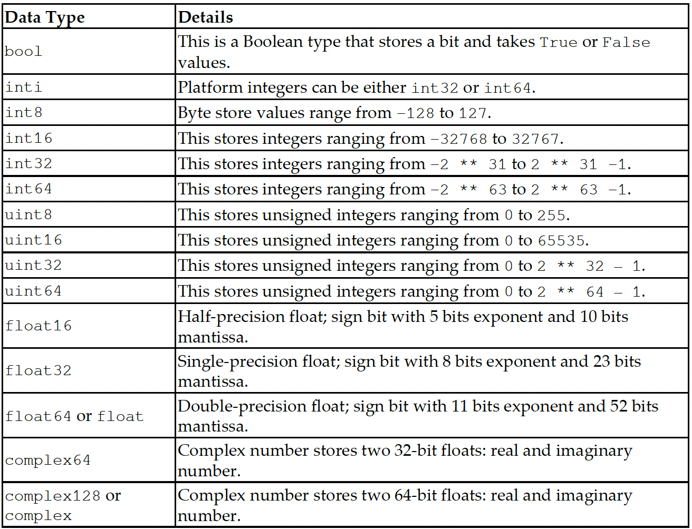

# Chapter2: NumPy and Pandas

## Topic Covered
- Creating NumPy views and copies
- Slicing NumPy arrays
- Boolean and fancy indexing
- Broadcasting arrays
- Creating pandas DataFrames
- Understanding pandas Series
- Reading and querying Quandl data
- Describing pandas DataFrames
- Grouping and joining pandas DataFrames
- Handling missing values
- Creating pivot tables
- Working with dates

## NumPy array numerical data types

Python has three basic numerical data types: integers, floats, and complex numbers. But for scientific computing, we often need more precision, range, or specific sizes. NumPy provides a wide variety of numerical data types to handle these needs. Here's a table (in the book) that lists all the NumPy numerical types.

## Data type character codes

NumPy uses single-character codes to represent different data types for efficient memory usage and processing. These codes include:

'i': Integer types (e.g., int32, int64)
'f': Floating-point types (e.g., float32, float64)
'c': Complex numbers (e.g., complex64, complex128)
'b': Boolean type (True/False)
'U': Unicode string
'S': Byte string
'O': Object type (e.g., Python objects)
These codes allow for concise representation and easy manipulation of data types in NumPy arrays.

## dtype constructors

NumPy provides dtype constructors to define and customize the data types of arrays. These constructors are helpful when you need precise control over the type and structure of your data. Here’s how they work:

**Predefined dtypes**: Use built-in NumPy types like np.int32, np.float64, etc., to specify the data type directly.
**String codes**: Use shorthand single-character codes (e.g., 'i' for integers, 'f' for floats) for quick definitions.
**Custom dtypes**: Create structured or compound data types using np.dtype with a list of tuples or a dictionary.

These constructors make it easy to work with different types of data, whether it’s simple numerical arrays or more complex structured data.

## dtype attributes

NumPy dtype objects come with several attributes that provide detailed information about the data type. These attributes are useful for understanding and working with the structure of arrays. Here are the key ones:

**dtype.type**: The type of the data (e.g., np.int32, np.float64).
**dtype.kind**: A single character representing the general category of the data type (e.g., 'i' for integers, 'f' for floats, 'U' for Unicode strings).
**dtype.itemsize**: The size (in bytes) of each element in the array.
**dtype.name**: A string representation of the data type (e.g., 'int32', 'float64').
**dtype.str**: A string representation of the dtype in shorthand notation.
These attributes make it easy to inspect and understand the data types of NumPy arrays.

The ravel() function is similar to the flatten() function. It also transforms an n-dimensional array into a one-dimensional array. The main difference is that
flatten() returns the actual array while ravel() returns the reference of the original array. The ravel() function is faster than the flatten() function because it does not occupy extra memory: