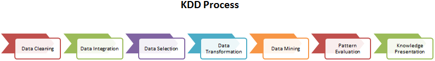
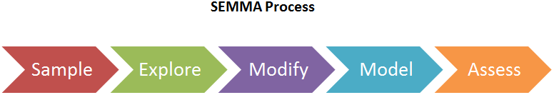
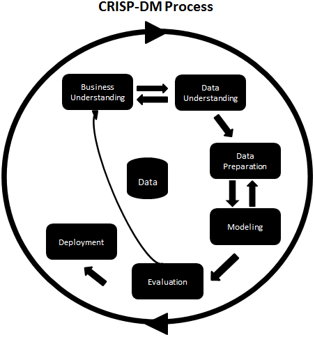

# Chapter1: Getting Started with PythonLibraries

## Topic Covered

- Understanding data analysis
- The standard process of data analysis
- The KDD process
- SEMMA
- CRISP-DM
- Comparing data analysis and data science
- The skillsets of data analysts and data scientists
- Installing Python 3
- Software used in this book
- Using IPython as a shell
- Using Jupyter Lab
- Using Jupyter Notebooks
- Advanced features of Jupyter Notebooks

**NumPy:** This is a short form of numerical Python. It is the most powerful scientific library available in Python for handling multidimensional arrays,matrices, and methods in order to compute mathematics efficiently.

**SciPy:** This is also a powerful scientific computing library for performing
scientific, mathematical, and engineering operations.

**Pandas:** This is a data exploration and manipulation library that offers tabular data structures such as DataFrames and various methods for data analysis and manipulation.

**Scikit-learn:** This stands for "Scientific Toolkit for Machine learning". It is a machine learning library that offers a variety of supervised and unsupervised algorithms, such as regression, classification, dimensionality reduction, cluster analysis, and anomaly detection.

**Matplotlib:** This is a core data visualization library and is the base library for all other visualization libraries in Python. It offers 2D and 3D plots, graphs, charts,and figures for data exploration. It runs on top of NumPy and SciPy.

**Seaborn:** This is based on Matplotlib and offers easy to draw, high-level,interactive, and more organized plots.

**Plotly:** Plotly is a data visualization library. It offers high quality and interactive graphs, such as scatter charts, line charts, bar charts, histograms, boxplots,heatmaps, and subplots.

### The KDD process

The **KDD** acronym stands for **knowledge discovery from data or Knowledge Discovery in Databases**. Many people treat KDD as one synonym for data mining. Data mining is referred to as the knowledge discovery process of interesting patterns. The main objective of KDD is to extract or discover hidden interesting patterns from large databases, data
warehouses, and other web and information repositories.

The KDD process has seven major phases:

1. **Data Cleaning:** In this first phase, data is preprocessed. Here, noise is removed,
missing values are handled, and outliers are detected.
2. **Data Integration:** In this phase, data from different sources is combined and
integrated together using data migration and ETL tools.
3. **Data Selection:** In this phase, relevant data for the analysis task is recollected.
4. **Data Transformation:** In this phase, data is engineered in the required
appropriate form for analysis.
5. **Data Mining:** In this phase, data mining techniques are used to discover useful
and unknown patterns.
6. **Pattern Evaluation:** In this phase, the extracted patterns are evaluated.
7. **Knowledge Presentation:** After pattern evaluation, the extracted knowledge
needs to be visualized and presented to business people for decision-making
purposes.

### SEMMA

The **SEMMA** acronym's full form is **Sample, Explore, Modify, Model,** and **Assess.** This sequential data mining process is developed by SAS. The SEMMA process has five major phases:

1. **Sample:** In this phase, we identify different databases and merge them. After this, we select the data sample that's sufficient for the modeling process.
2. **Explore:** In this phase, we understand the data, discover the relationships among variables, visualize the data, and get initial interpretations.
3. **Modify:** In this phase, data is prepared for modeling. This phase involves dealing with missing values, detecting outliers, transforming features, and creating new additional features.
4. **Model:** In this phase, the main concern is selecting and applying different modeling techniques, such as linear and logistic regression, backpropagation networks, KNN, support vector machines, decision trees, and Random Forest.
5. **Assess:** In this last phase, the predictive models that have been developed are evaluated using performance evaluation measures.

### CRISP-DM

**CRISP-DM'** s full form is **CRoss-InduStry Process for Data Mining**. CRISP-DM is a welldefined,well-structured, and well-proven process for machine learning, data mining, and business intelligence projects. It is a robust, flexible, cyclic, useful, and practical approach to solving business problems. The process discovers hidden valuable information or patterns from several databases.

The CRISP-DM process has six major phases:

1. **Business Understanding:** In this first phase, the main objective is to understand the business scenario and requirements for designing an analytical goal and initial action plan.
2. **Data Understanding:** In this phase, the main objective is to understand the data and its collection process, perform data quality checks, and gain initial insights.
3. **Data Preparation:** In this phase, the main objective is to prepare analytics-ready data. This involves handling missing values, outlier detection and handling, normalizing data, and feature engineering. This phase is the most time consuming for data scientists/analysts.
4. **Modeling:** This is the most exciting phase of the whole process since this is where you design the model for prediction purposes. First, the analyst needs to decide on the modeling technique and develop models based on data.
5. **Evaluation:** Once the model has been developed, it's time to assess and test the model's performance on validation and test data using model evaluation measures such as MSE, RMSE, R-Square for regression and accuracy, precision, recall, and the F1-measure.
6. **Deployment:** In this final phase, the model that was chosen in the previous step will be deployed to the production environment. This requires a team effort from data scientists software developers, DevOps experts, and business professionals.

### The roles of data analysts and data scientists

**Data Analyst** collects, filters, processes, and applies the required statistical concepts to capture patterns, trends, and insights from data and prepare reports for making decisions. The main objective of the data analyst is to help companies solve business problems using discovered patterns and trends. The data analyst also assesses the quality of the data and,handles the issues concerning data acquisition.A data analyst should be proficient in writing SQL queries, finding patterns, using visualization tools, and using reporting tools Microsoft Power BI, IBM Cognos, Tableau, QlikView, Oracle BI, and more.

**Data scientists** are more technical and mathematical than data analysts. Data scientists are research- and academic-oriented, whereas data analysts are more application-oriented.Data scientists are expected to predict a future event, whereas data analysts extract significant insights out of data. Data scientists develop their own questions, while data analysts find answers to given questions. Data scientists focus on **what is going to happen**, whereas data analysts focus on **what has happened so far.** 

